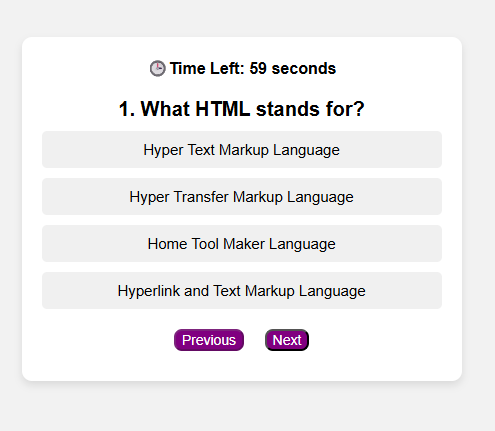

# 🧠 Quiz App

A responsive Quiz Application built using HTML, CSS, and JavaScript. Test your HTML, CSS, and JavaScript knowledge with a timed quiz and instant score calculation.

## ✨ Features

- 👤 User name validation
- ❓ 10 multiple-choice questions
- ⏱️ 60-second countdown timer
- ⬅️➡️ Previous and Next navigation
- ✅ Highlights correct and incorrect answers
- 📱 Responsive design

## 🛠️ Technologies Used

- HTML5
- CSS3
- JavaScript (ES6)

## 🚀 How to Run

1. Clone the repository

```bash
git clone https://github.com/sam123227/quiz-app.git
```

2. Open the project folder

```bash
cd quiz-app
```

3. Open `index.html` in your browser.

## 📸 Screenshot



## 🌐 Live Demo

https://quiz-app-self-beta.vercel.app/


## 👨‍💻 Author

**Samir**
